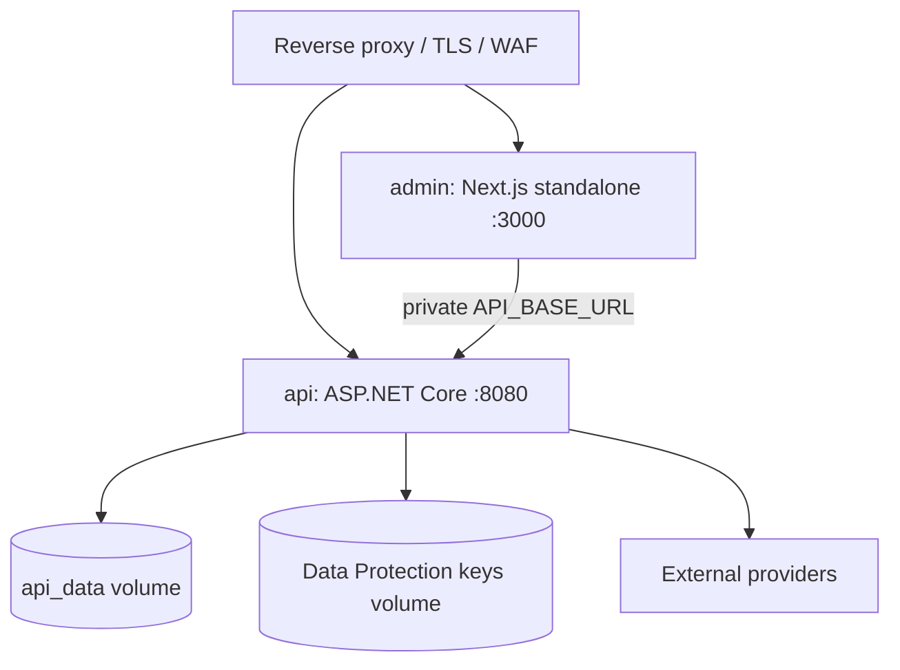

# Container diagram

```mermaid
flowchart TB
    Proxy[Reverse proxy / TLS / WAF]
    Proxy --> Admin[admin: Next.js standalone :3000]
    Proxy --> API[api: ASP.NET Core :8080]
    Admin -->|private API_BASE_URL| API
    API --> Data[(api_data volume)]
    API --> Keys[(Data Protection keys volume)]
    API --> External[External providers]
```

الحاويتان تعملان كمستخدمين غير root ولهما liveness/readiness checks. لا يُعرض منفذاهما للعامة في ملف production؛ يُربطان على loopback ويُنشران فقط خلف reverse proxy موثوق.
