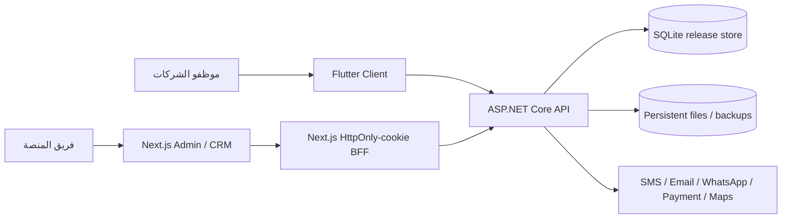

# System context

- الـAPI هي حدود الثقة ومصدر الصلاحيات وعزل الشركات؛ الواجهة لا تُعد طبقة حماية.
- لوحة الإدارة لا تضع access/refresh tokens في JavaScript؛ تحفظها BFF في HttpOnly cookies.
- تكاملات الإنتاج تعمل عبر adapters وتظل credentials خارج Git.
- إصدار Docker الحالي single-instance مع SQLite وvolume دائم. الانتقال إلى SQL Server يحتاج migration set خاصًا بالمزود واختبار cutover.
