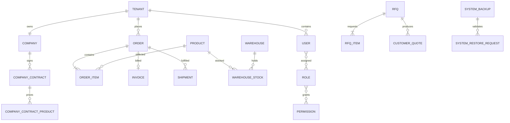

# Database ERD — logical view

هذا رسم منطقي لأهم العلاقات فقط. المصدر التنفيذي الكامل هو EF model snapshot في `apps/api/Migrations/AppDbContextModelSnapshot.cs`، وتطبق migrations من الصفر ضمن اختبار `MigrationIntegrityTests`.
